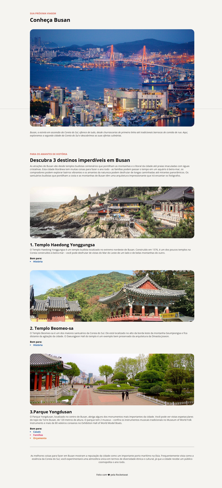

# 🌊 Local Turístico - Busan

  

## 📝 Sobre o Projeto

Este é um projeto de página web que apresenta Busan, uma cidade vibrante da Coreia do Sul, destacando seus principais pontos turísticos e atrações culturais. A página foi desenvolvida como parte do desafio prático da Rocketseat.

Descrição completa do desafio: https://efficient-sloth-d85.notion.site/Desafio-pr-tico-Local-Tur-stico-c703fe13a3d44f3687277f424ffad157

O Layout no Figma:
[Layout no Figma](https://www.figma.com/community/file/1384542229391733447)

## 🚀 Tecnologias Utilizadas

- HTML5
- CSS3
- Google Fonts (Open Sans)
