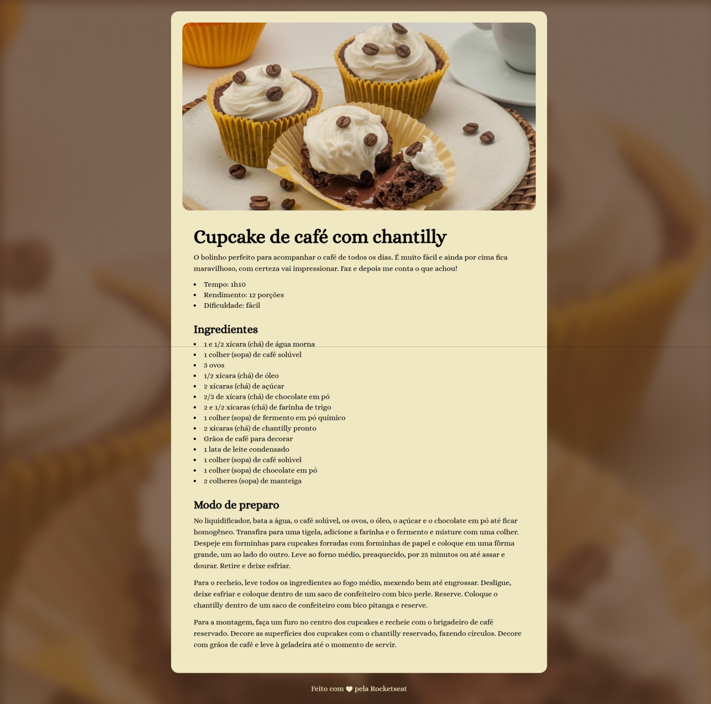

# 🍰 Página de Receita

  

## 📝 Sobre o Projeto

Este é um projeto de uma página web que apresenta uma receita de Cupcake de café com chantilly. O layout foi desenvolvido como parte dos estudos de HTML e CSS, seguindo o design disponível no Figma.

## 🚀 Tecnologias Utilizadas

- HTML5
- CSS3
- Google Fonts (Alice)

## 🎨 Layout

O Layout no Figma pode ser acessado através do link:
[Layout no Figma](https://www.figma.com/community/file/1360315130061454535)
